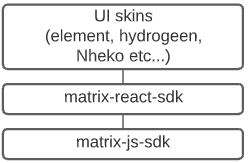

# Export Conversations Functionality

## Introduction

Ability to export conversations is one of the most important features in communication Apps in general, making the user able to backup his history and saving it into his own local machine is one of the key features that most communications Apps provide out there.

As this feature is very important but it also seams very simple to implement as one two three, right ?

1. GET the messages from the server.
2. FORMAT the data into the any desired format.
3. DOWNLOAD the file.

Well, it is not that easy. as Matrix is end to end encrypted so the "messages" here is not a plain text.

This might add some complexity and limitation to those simple three steps above that will be explained in this next sections. but for now lets map our mind around those three simple steps GET, FORMAT then, DOWNLOAD.


## Matrix Architecture

First things first, we need understand how matrix runs. I'll cover briefly my understanding about the most involved parts in this project.

Matrix client are consists of three main layers:



### Matrix JS SDK
>This SDK provides a full object model around the Matrix Client-Server API and emits events for incoming data and state changes. Aside from wrapping the HTTP API.

`matrix-js-sdk` provides a lot of APIs that might be useful to solve our problem such as:

* Handles Pagination
* Handles syncing (via /initialSync and /events)
* Handles historical `RoomMember` information (e.g. display names)
* Handle queueing of messages.

And more.

### Matrix React SDK
> This is a react-based SDK for inserting a Matrix chat/voip client into a web page.

In this layer we will add all web and all react components needed

## Implementing Exporting Functionality

> NOTE: All codes in this document is just my thoughts about the implementation, The purpose of writing this code is rounding out the idea and simplifying it for the reader, and it is not considered as a production ready code.  

As discussed with the community [here](https://github.com/vector-im/element-web/issues/2630).
The functionality should be implemented on each room individually, and also we have to add a way to limit the number of exported events, that because of the expenses of decrypting on the client side ( Resources limitations )  

As mentioned in introduction this function has three phases to implement GET, FORMAT and DOWNLOAD.
In this section I'll describe How I thought about implementing those there phases.
### GET

As `matrix-js-sdk` holds all communications with client server and handles all events and encryption stuff, I think it is the best place to add this phase into this SKD let it handle getting the room's events ( messages and state events ) by calling  [ GET /_matrix/client/r0/rooms/{roomId}/messages](https://matrix.org/docs/spec/client_server/latest#id267)  from the home server getting encrypted events from the server.
> note: A private function into `MatrixClient` can be used to make this call `_createMessagesRequest`

> All this logic should be added into `MatrixClient` class to be provided in the client object into `matrix-react-sdk`

here is a pseudo code for how we can impalement the GET function into `MatrixClient`

``` javascript
    MatrixClient.prototype._exportMessagesHistoryByRoomID = async function  (roomID, limit) {
        // limit here should be calculated by the consumer
        const token = eventTimeline.getPaginationToken(dir);
        // direction here should be BACKWARDS always.
        const dir = EventTimeline.BACKWARDS;

        const response = await this._createMessagesRequest(
            roomID,
            token,
            limit,
            dir);

        const encryptedEvents = await this._decryptEventsForExport(response);

        return encryptedEvents
    }

```
Well, until this point we have all the events needed to export now lets implement `_decryptEvents()` function that decrypts the events.

Here we have two types of events `StateEvents` and `MatrixEvents`, we can found it into `state` and `chunk` array respectively in the API call response.

we can use  `map` function ( functional programming ) to map the encrypted events arrays into typed objects that represent the `stateEvents` and `matrixEvents` that has all functionality of decrypting them into

now we have ton of events that we need to be decrypted.

 into `MatrixEvents` we have function called `attemptDecryption` that called into the mapper mentioned above and this function sets `_decryptionPromise` private property into the event object, this function also waiting util the promise fulfield and set another private property called `_clearEvent` looks like this

``` javascript
{
    _clearEvent: {
        content:
        body: "Hello their"
        msgtype: "m.text"
    }
}
```

yes this what we waiting for.

we need to make some function into `MatrixEvent` that keeps tracking an array  of events to be decrypted and return all decrypted messages.

> At this point we might fall into recourses issue because the events here must be limited to not exceed the call stack on browser.  

whoever the  `_decryptEventsForExport` should be looks like this

```javascript
MatrixClient.prototype._decryptEventsForExport = async function (res) {
    const stateEvents = res.state ?  utils.map(res.state, self.getEventMapper():{};
    const matrixEvents = utils.map(res.chunk, self.getEventMapper());

    // This function should implemented into MatrixEvent class that takes an array of events
    // and return a promise resolves after all promises of decryption if ended  
    const decryptedMatrixEvents = await MatrixEvent.decryptAll(matrixEvents);
    const decryptedStateEvents = await await MatrixEvent.decryptAll(stateEvents);

    return {
        stateEvents: decryptedStateEvents,
        matrixEvents: decryptedMatrixEvents
    }
}
```

Now as a result we have all events we need decrypted, actually not all of them.

Some events might be not decrypted because of losing megolm sessions needed to decyrpt it in this case we might can use key backup, or request keys from your other devices, after that if we still don't have the keys, then we give up and say we just can't decrypt it.

Okay, now we've done with this phase lets go and format the data we got form this function.

### FORMAT

Formatting the returned event should be very simple task, get the desired format from the user , map on the array and write your file as simple as that.

Matrix has a lot of event types and all types are manged into `matrix-react-sdk` in function called `textForEvent` in `TextForEvent.js` file.

this function takes the matrix event object and identify its type then returns translated string that describe the event, "Magic".

now we can format the events easily into any desired format.


