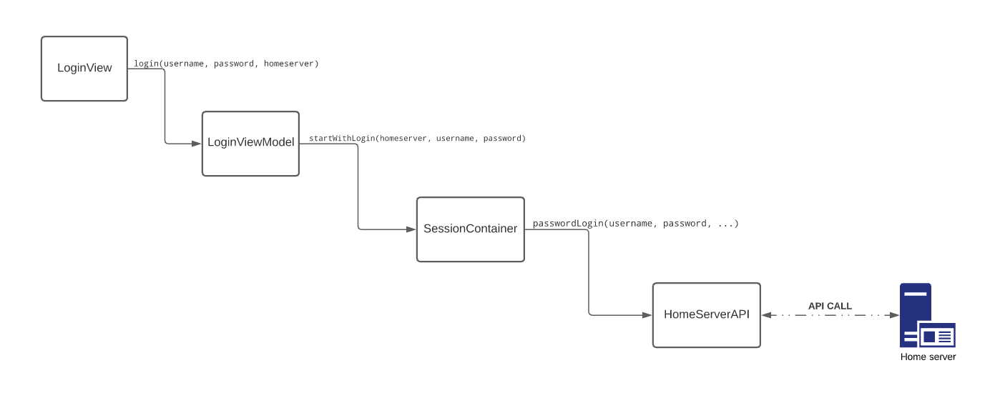

# SSO In Hydrogen

## Introduction

Hydrogen is a Matrix chat client, built to provide seamless mobile first experience on mobile web browsers.

Single Sign-ON (SSO) is one of the most important authentication scheme in the industry, since it becomes with a great improvement of user experience in apps.

Matrix provides bunch of choses to authenticate users using SSO, that has been also implemented into all other matrix chat clients, so it a key feature to be implemented into hydrogen as well.
## Login in Hydrogen

In `src/platform/web/ui/login` we have all views related to the login view.<br>
`LoginView` is the main view that represent the basic email-password inputs and the home server url input that make the user able to sign into the app.


Login view are rendered into `RootView`, well in the `LoginView` we just start login through the `LoginViewModel` through `SessionContainer` which is the Model that will handles all our session data, pressing login button will call `login()` method passing user inputs username, password and homeServer URL which is setting up the `SessionLoadViewModel` and tracking it then  call the `startWithLogin()` method from a new object of the `SessionContainer`, then the session container start a password login by making a new object from `HomeServerAPI` and call password login method. Hmm , lets simplify it with diagram.



lets call it the "login flow diagram" as we gonna referee to it in next sections and modify it.
## Login Flows in Matrix

Matrix main home server is depend on varies authentication flows one of these flows is SSO, all supported authentication flows are provided into the `homeServer` in this [Docs](https://matrix.org/docs/spec/client_server/latest#id204).

the return of the login flows API call should be something like that

``` JSON
[
  {
    "type": "m.login.sso",
    "identity_providers": [
      {
        "id": "oidc-github",
        "name": "GitHub",
        "icon": "mxc://matrix.org/sVesTtrFDTpXRbYfpahuJsKP",
        "brand": "github"
      },
      {
        "id": "oidc-google",
        "name": "Google",
        "icon": "mxc://matrix.org/ZlnaaZNPxtUuQemvgQzlOlkz",
        "brand": "google"
      },
      {
        "id": "oidc-gitlab",
        "name": "GitLab",
        "icon": "mxc://matrix.org/MCVOEmFgVieKFshPxmnejWOq",
        "brand": "gitlab"
      },
      {
        "id": "oidc-facebook",
        "name": "Facebook",
        "icon": "mxc://matrix.org/nsyeLIgzxazZmJadflMAsAWG",
        "brand": "facebook"
      },
      {
        "id": "oidc-apple",
        "name": "Apple",
        "icon": "mxc://matrix.org/QQKNSOdLiMHtJhzeAObmkFiU",
        "brand": "apple"
      }
    ],
  },
  {
    "type": "m.login.token"
  },
  {
    "type": "m.login.password"
  },
  {
    "type": "uk.half-shot.msc2778.login.application_service"
  }
]
```

As we can see here, the return of `loginFlow` End point based on what the `homeServer` supports.

Well, lets have a deeper dive into `Hydrogen` trying to figure out how we can impalement this feature.

## Implementation

>NOTE: All codes in this document is just my thoughts about the implementation, The purpose of writing this code is rounding out the idea and simplifying it for the reader, and it is not considered as a production ready code.

To add SSO in Hydrogen, first we need call the login flow end point, adjust the view, then make the SSO authentication process.

So, to call the end point the home server URL should be provided first, to do that we need to add this new API call into our `HomeServer` service  to be something like that.

``` javascript
  getSupportedLoginMethods (options = null) {
    return this._get("/login", null, null, options);
  }
```
Now the `HomeServer` class has the functionality to do the HTTP call to get the login flows mentioned above form the home server.

We need to call this method in a proper context to loginFlow which we can move forward.

In the Login view currently we just support the password login flow, we need to adjust this view to wait for the login flows call to be fulfilled and then map another two new views ( or more in the future ) specific for every flow.

So again, we need to split the login view into two views one for password login flow lets call it `PasswordView` and the other for sso login flow `SSOLoginFlow`.

The initial `LoginView` should be something like this


And after loading the flows and map the new views it should be something like


