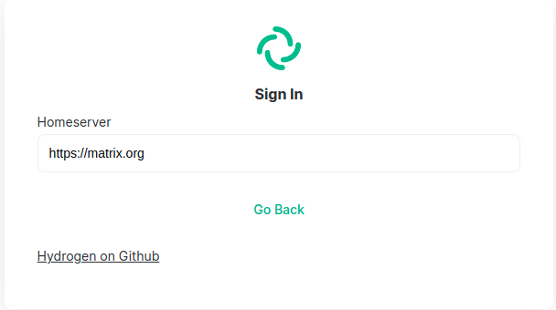

# Personal Information

**Name:** Tawfiek allah Khalaf Eldeep

**Phone:** +201118772996

**E-mail:** tawfiek.108@gmail.com

**LinkedIn:**  [in/tawfiek](https://www.linkedin.com/in/tawfiek/)

**Twitter:**  [@tawfiekallah](https://twitter.com/tawfiekallah)


# About me

## Introduction
Software developer with 4 years of experience in the market, having good experience with open source communities.
It is my first contribution with Matrix this year as a GSoC participants, currently I am working in one of fin-tech startups companies as a full stack software developer.

Also I am currently studying communication and electronics engineering part-time.
## Other Commitments

* 13 - 15 May  Holidays.

* 3 - 17 July  Final Exams.

## Open Source Contributions

I consider myself as an open source lover, I believe in open source value to the development community and improving my development skills, that's why I am trying to contribute from time to time into one of projects that I use everyday in my work, one of the most contribution I am proud of that one with ionic framework [#16851](https://github.com/ionic-team/ionic-framework/pull/16851), this one I was need to implement a `text-area` in ionic alert component in one of projects I was working on, and there was no way to do that in ionic 4 ( the version I was using this time), I thought okay lets go impalement it myself in ionic , why not ?!

As it is my final year in the collage, I think I'll have more time in the future to pay more attention to the Open source in general. and I think GSoC and Matrix will be a good station to help me to do that.

## My contributions with matrix

I didn't do too much with `Matrix` Actually in the last period I tried to  make my hands dirty in some easy issues in `element` I did make some pull requests on `matrix-react-sdk` solving some stuff, also I got familiar with `hydrogen` and it's SSO feature request, I think it was great journey to get into different matrix solutions code base.

### Matrix React SDK

* [Make buttons in verify dialog respect the system font ](https://github.com/matrix-org/matrix-react-sdk/pull/5778)
* [Adding description for Clear Cache and Reload Button in Settings](https://github.com/matrix-org/matrix-react-sdk/pull/5811)


### Hydrogen

* [Setup docdash for the project](https://github.com/vector-im/hydrogen-web/pull/302)
* [Add SSO functionality](https://github.com/vector-im/hydrogen-web/pull/282)


# SSO In Hydrogen

## Introduction

Hydrogen is a Matrix chat client, built to provide seamless mobile first experience on mobile web browsers.

Single Sign-ON (SSO) is one of the most important authentication scheme in the industry, since it becomes with a great improvement of user experience in apps.

Matrix provides bunch of choses to authenticate users using SSO, that has been also implemented into all other matrix chat clients, so it a key feature to be implemented into hydrogen as well.
## Login in Hydrogen

In `src/platform/web/ui/login` we have all views related to the login view.<br>
`LoginView` is the main view that represent the basic email-password inputs and the home server url input that make the user able to sign into the app.


Login view are rendered into `RootView`, well in the `LoginView` we just start login through the `LoginViewModel` through `SessionContainer` which is the Model that will handles all our session data, pressing login button will call `login()` method passing user inputs username, password and homeServer URL which is setting up the `SessionLoadViewModel` and tracking it then  call the `startWithLogin()` method from a new object of the `SessionContainer`, then the session container start a password login by making a new object from `HomeServerAPI` and call password login method. Hmm , lets simplify it with diagram.


lets call it the "login flow diagram" as we gonna referee to it in next sections and modify it.
## Login Flows in Matrix

Matrix main home server is depend on varies authentication flows one of these flows is SSO, all supported authentication flows are provided into the `homeServer` in this [Docs](https://matrix.org/docs/spec/client_server/latest#id204).

the return of the login flows API call should be something like that

``` JSON
[
  {
    "type": "m.login.sso",
    "identity_providers": [
      {
        "id": "oidc-github",
        "name": "GitHub",
        "icon": "mxc://matrix.org/sVesTtrFDTpXRbYfpahuJsKP",
        "brand": "github"
      },
      {
        "id": "oidc-google",
        "name": "Google",
        "icon": "mxc://matrix.org/ZlnaaZNPxtUuQemvgQzlOlkz",
        "brand": "google"
      },

    ],
  },
  {
    "type": "m.login.token"
  },
  {
    "type": "m.login.password"
  },
  {
    "type": "uk.half-shot.msc2778.login.application_service"
  }
]
```

As we can see here, the return of `loginFlow` End point based on what the `homeServer` supports.

Well, lets have a deeper dive into `Hydrogen` trying to figure out how we can impalement this feature.

## Implementation

>NOTE: All codes in this document is just my thoughts about the implementation, The purpose of writing this code is rounding out the idea and simplifying it for the reader, and it is not considered as a production ready code.

### Adding login flows call into `HomeServer` class

To add SSO in Hydrogen, first we need call the login flow end point, adjust the view, then make the SSO authentication process.

So, to call the end point the home server URL should be provided first, to do that we need to add this new API call into our `HomeServer` service  to be something like that.

``` javascript
  getSupportedLoginMethods (options = null) {
    return this._get("/login", null, null, options);
  }
```
Now the `HomeServer` class has the functionality to do the HTTP call to get the login flows mentioned above form the home server.

We need to call this method in a proper context to loginFlow which we can move forward.

### Session Container
In session container we should add the `requestSupportedLoginFlows` method which is making a new object of `HomeServer` and call the new  method we added above to make the call then set the status of the container

```javascript
  async requestSupportedLoginFlows(homeServer) {
    ...

    const hsApi = new HomeServerApi({
        homeServer,
        request,
        createTimeout: clock.createTimeout,
    });
    this._supportedLoginFlows =  
      await hsApi.getSupportedLoginMethods().response();
    this._status.set(LoadStatus.LoginFlowsLoaded.find());

    ...

  }
```

### `LoginView`

In the Login view currently we just support the password login flow, we need to adjust this view to wait for the login flows call to be fulfilled and then map another two new views ( or more in the future ) specific for every flow.

So again, we need to split the login view into two views one for password login flow lets call it `PasswordView` and the other for sso login flow `SSOLoginFlow`.

The initial `LoginView` should be something like this



And after loading the flows and map the new views it should be something like


The request fo the login flow should be done from the `LoginModelView` which it handles our domain and logic, in `LoginModelView` we should make an event handler that handles the change in homeserver input change event, by loading the login views, it should be something like that

``` javascript
  _requestLoginFlows (homeServer) {
    //  Here we make new object of the Loading flow view model
    // This View should make a new loader spinner to indicates the login flow is loading
    // This view creates new session container load the login flow through it ,
    //  and when it's done the ready method should be called to map the login view to add the login flows supported as shown in the above views.

    this._ladLoginFlowViewModel  = this.track(new LoadLoginFlowViewModel({
        createAndStartSessionContainer: () => {
            this._sessionContainer = this._createSessionContainer();
            this._sessionContainer.requestSupportedLoginFlows(homeServer);
            return this._sessionContainer;
        },
        ready: sessionContainer => {
            this._sessionContainer = null;
            this._supportedLoginFlows = _supportedLoginFlows
        },
        homeServer,
    }));

    this._loadLoginFlowViewModel.start();
    this.emitChange('loadLoginFlowViewModel');
  }
```
The ready method here should be called by the `LoadLoginFlowViewModel` to set the incoming supported login flows.

In the login view the new views should be mapped using mapView method in the template.

For SSO login flow view for example:

```javascript
  t.mapView(
    (vm) => vm.loadLoginFlowViewModel,
    (loadLoginFlowViewModel) =>
        loadLoginFlowViewModel
            ? getSSOViewIfSupported()
            : null
  ),


  function getSSOViewIfSupported () {
    if (vm.supportedLoginFlows.find(f => f.type === 'm.login.sso' )) {
      return new SSOLoginViewModel ()
    } else {
      return;
    }
  }

```

And so on for all login flows.

### SSO Flow Implementation

When user press any buttons in the SSO view we should start the SSO authentication with the `homeServer` through `/_matrix/client/r0/login/sso/redirect` end point. This end point takes the a query parameter called `redirectUrl` which a string of the app URL.

Before calling the SSO end point we should store the home server URL to be returned after the authentication done into the `homeServer`

``` javascript
    platform.settingsStorage.setString("sso_homeserver", loginOptions.homeserver);
```
In session container a function should be built to handel calling the SSO.

After calling this API home server will take care of authentication process then it will redirect to our app with the URL provided to it, `<app url>/?loginToken=<some login token>` <br>
In this case the user is successfully authenticated and we need to start a token based authentication from this point, using the token provided by the home server in `loginToke` query param.

Now we need to modify `startWithLogin` method to conditionally start a password login or token login and inject the `loginToken` into it,
and in the home server we should add a new method also to make the call to login using the token provided by calling the `/login` end point with the flowing payload.

``` JSON
{
  "type": "m.login.token",
  "token": "<token>",
  "txn_id": "<client generated nonce>",
  "session": "<session ID>"
}
```

A new view should handle the redirected path, we can call it `CompleteSSOLoginView` for example.
and in the model-view we can call all session stuff above, we can use `SessionLoadView` into it to make meaningful loading spinier and label.


# Schedule

Estimated Duration | Estimated Start/End Time     | Task
-------------------| ---------------------------- | -------------------------------------
1 Month            | April 13, 2021 - May 16, 2021| Continue practicing in matrix in some related area to the project, and communicate with community and mentors to discuss the project
4 weeks            | May 17, 2021 - June 7, 2021  | Community Bonding. in this period should discuss the implementation with the community into the communication channels and the related issue on github for better understanding the limitations and all corner cases should be handled in this feature.
6 weeks            | July 16, 2021 - August 16, 2021 | Impalement all UIs, making the login flows call and caching and start the SSO call. (Test all functionality until it's making the SSO call to the home server)
1 week             | August 16 - 23, 2021         | First Evaluations.
1 month            | July 16, 2021 - August 16, 2021 | Handle all redirect stuff, adding the new views and test all the end product to deliver a fully functional SSO .
2 weeks            | August 16 - 30, 2021        | All codes should be submitted and discuss any issues with the community
Ongoing             | -- | Support this feature, and paying some efforts to test and document hydrogen to be more community friendly
